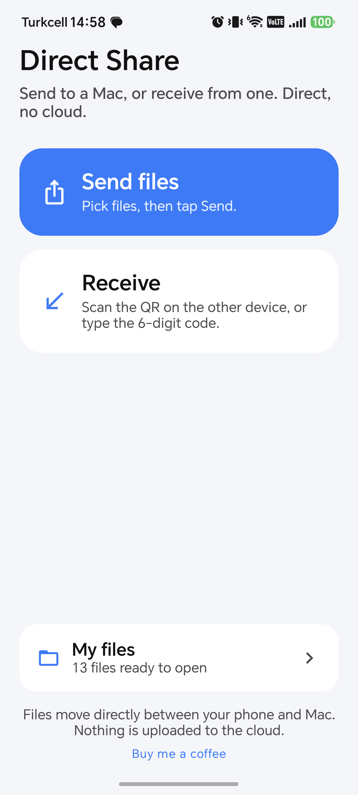
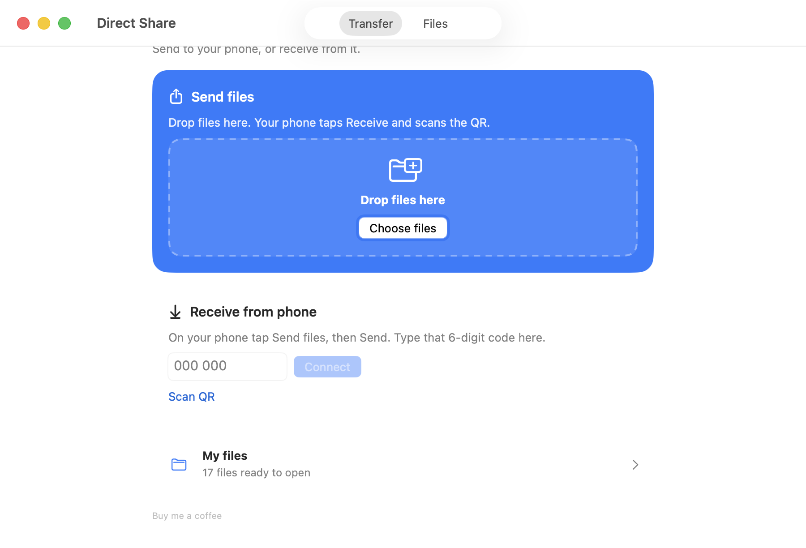

<p align="center">
  
</p>

<h1 align="center">Direct Share</h1>

<p align="center">
  Native Android ↔ Mac file transfer, no cloud.
</p>

<p align="center">
  <a href="https://github.com/MoomenALdahdouh/honor-share/actions/workflows/build.yml"></a>
  <a href="LICENSE"></a>
  <a href="https://github.com/MoomenALdahdouh/honor-share/releases"></a>
  <a href="android/"></a>
  <a href="macos/"></a>
</p>

---

## Overview

Direct Share is two native apps and one local protocol. An Android phone and a Mac find each other with Bonjour (`_honor-share._tcp`), then send files over TLS on the same Wi-Fi. There is no account, no backend, and no internet requirement. Install both sides, open the apps, and transfer the same way in either direction.

Received files land in `Downloads/HONOR Share`. The product name is Direct Share; on-disk folders, Bonjour, and TLS still use HONOR Share identifiers so existing devices keep talking.

---

## Screenshots

Real home screens from the running apps.

<p align="center">
  
  &nbsp;&nbsp;
  
</p>

---

## Installation

```bash
git clone https://github.com/MoomenALdahdouh/honor-share.git
cd honor-share

# macOS 13+ (Swift / Xcode Command Line Tools)
# Builds Direct Share.app, copies it to /Applications,
# and registers Finder → Services → Send with Direct Share
./macos/packaging/package-macos.sh
open "/Applications/Direct Share.app"

# Android 8+ (JDK 17)
cd android
./gradlew :app:assembleDebug
adb install -r app/build/outputs/apk/debug/app-debug.apk
```

Prebuilt binaries: latest [build](https://github.com/MoomenALdahdouh/honor-share/actions/workflows/build.yml) run → **Direct-Share-macOS** (unzip into `/Applications`) or **Direct-Share-Android** (`app-debug.apk`).

Both devices must be on the same Wi-Fi (a phone hotspot counts). Allow Local Network / nearby devices when the OS asks.

---

## Usage

1. Open Direct Share on the phone and the Mac. Internet is not required.
2. **Mac → phone:** drop files on the Mac window, or right-click a file in Finder → **Services → Send with Direct Share**. On the phone tap **Receive** and scan the QR, or type the 6-digit code.
3. **Phone → Mac:** tap **Send files**, pick files, tap **Send**. On the Mac type that 6-digit code under Receive.
4. The first time two devices meet, compare the pairing code and tap **Connect** only if they match.

```text
Downloads/HONOR Share/{yyyy-MM-dd}/{peer name}/…
```

---

## Protocol

Discovery is Bonjour/mDNS. Transport is TLS 1.2/1.3 with length-prefixed JSON and SHA-256. Google Nearby Connections is not used; a Mac cannot join that fabric.

| Doc | What it covers |
| --- | --- |
| [docs/PROTOCOL.md](docs/PROTOCOL.md) | Wire format, HS2 invites, frames |
| [docs/ARCHITECTURE.md](docs/ARCHITECTURE.md) | Android and Mac modules |
| [docs/SECURITY.md](docs/SECURITY.md) | SAS pairing, pinning, threat model |
| [docs/TROUBLESHOOTING.md](docs/TROUBLESHOOTING.md) | Wi-Fi, permissions, Finder service |

---

## Development

```bash
# Android protocol tests + APK
cd android && ./gradlew :protocol:test :app:assembleDebug

# macOS protocol checks
cd macos && swift run HonorShareCheck

# App bundle
./macos/packaging/package-macos.sh
```

```text
android/     Kotlin, Jetpack Compose
macos/       Swift, SwiftUI, SwiftPM (no Xcode project required)
docs/        Protocol, security, testing
protocol/    Shared wire-format notes
```

See [CONTRIBUTING.md](CONTRIBUTING.md). Keep `_honor-share._tcp` and `Downloads/HONOR Share` unchanged.

---

## Support

Direct Share is free. If it helps you, you can [buy me a coffee](https://ko-fi.com/moomenaldahdouh).

<p align="center">
  <a href="https://ko-fi.com/moomenaldahdouh"></a>
</p>

---

## License

[MIT](LICENSE) © Moomen Al Dahdouh
